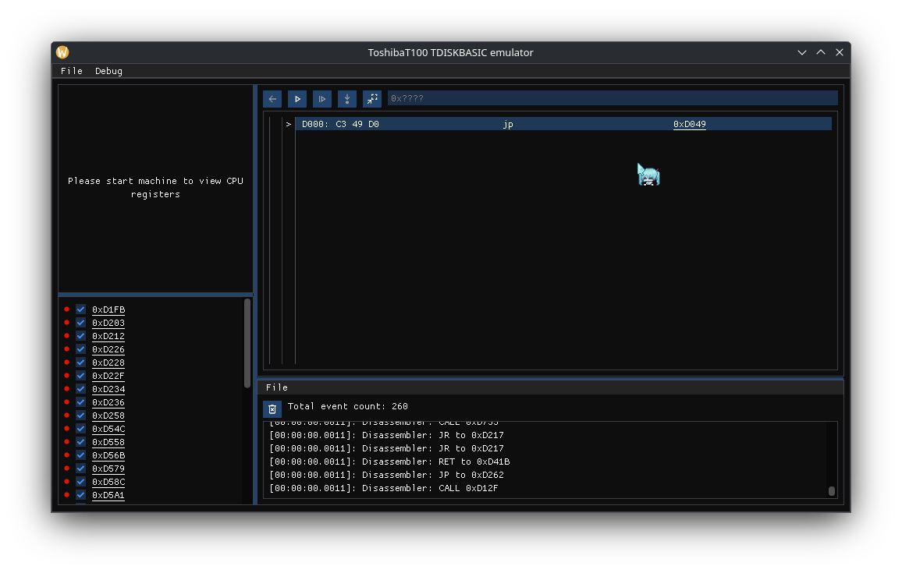

# Toshiba T100 PC
This is a project aim to emulate Toshiba T100 PC and to unveil the structure of FAT 8-bit filesystem. Specifically Toshiba T100 TDISKBASIC

## Screenshot
> [!IMPORTANT]
> **Debug** menu only appear if you manually specified `-DCMAKE_BUILD_TYPE=Debug` or `RelWithDebInfo`
> As you can see, I very suck at making UI, but good enough to use and understand what is going on

## Implementation Status
> [!IMPORTANT]
> Components aren't included in the list below won't be implemented for now
|Components|Device name|Official docs|Code behaviour|Status|
|-|-|-|-|-|
|Floppy Disk Controller|NEC µPD765|[Docs](./references/UPD765-NEC.pdf)|[Behaviour](./research/uPD765.md)|WIP
|Keyboard|Proprietary|[Docs](./references/ToshibaT100_tech_ref_Eng.pdf)|Unknown|❌

## References
- [1]. [ToshibaT100 Technical References](https://dn721605.ca.archive.org/0/items/toshiba-t-100-tech-ref-eng/ToshibaT100_tech_ref_Eng.pdf). [Archived](./references/ToshibaT100_tech_ref_Eng.pdf)
- [2]. [NEC µPD765 Specifications](https://datasheet4u.com/pdf-down/U/P/D/UPD765-NEC.pdf). [Archived](./references/UPD765-NEC.pdf)